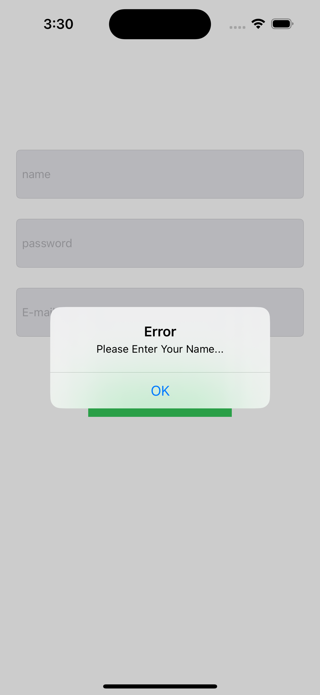
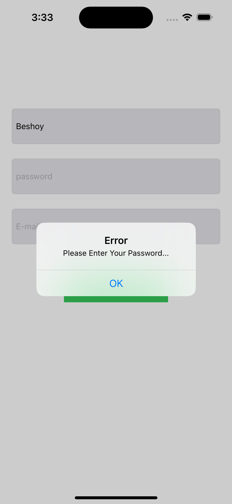
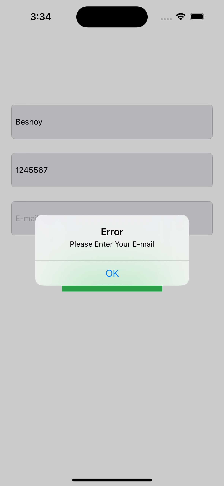
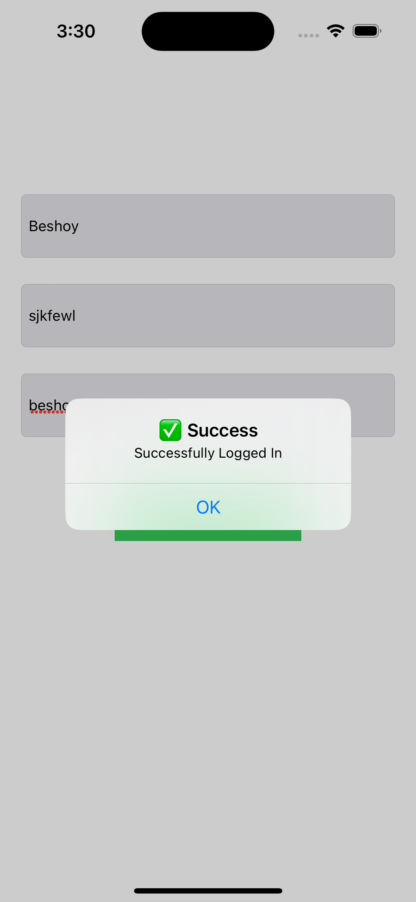
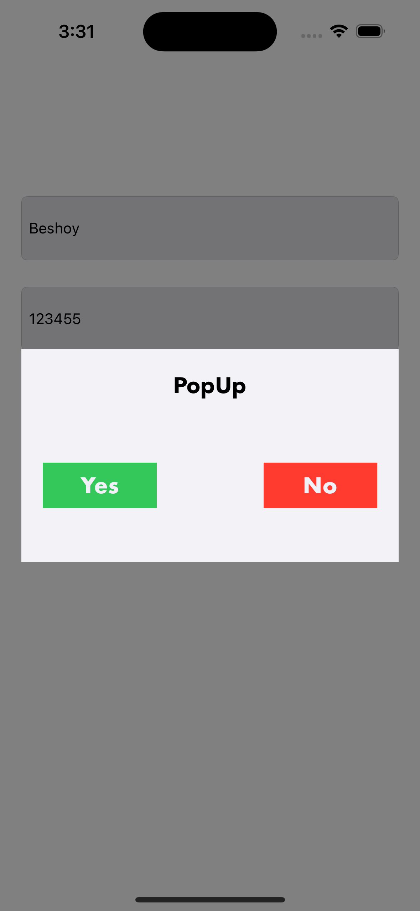

# LoginPracticeAlertValidation

A simple iOS application that demonstrates **basic user input validation** and screen navigation using **UIKit**.

## 📱 Project Description

**LoginApp** is a lightweight educational project built with UIKit. It showcases how to:
- Validate user inputs in a login screen
- Show alerts for missing fields
- Navigate to a popup screen if login is successful

The app includes:
- 🧾 A **Login Screen** with text fields for Name, Email, and Password
- 🔔 Error alerts for empty fields
- 🎉 A **PopUp Screen** shown upon successful login

## 🛠️ Technologies Used

- Swift  
- UIKit  
- Storyboard  
- Auto Layout  
- UIAlertController  
- ViewController navigation (`present`, `pushViewController`)

## ✨ Features

- Input validation (Name, Email, Password)
- Displays custom alert messages if any field is empty
- Presents a custom popup (`PopUpViewController`) if all inputs are filled
- Optional success flow that can push to another screen (`DataBackViewController`)
- Clean and simple UI

## 📸 Screenshots

  
  
  
  
  

> Replace the screenshots with actual images after running the app on simulator.

## 🚀 Getting Started

1. Open `LoginApp.xcodeproj` in **Xcode**.
2. Make sure the storyboard contains:
   - `LoginViewController` (**set as the initial view controller**)
   - `PopUpViewController` with **Storyboard ID = "PopUpViewController"**
   - *(Optional)* `DataBackViewController` if you plan to use the `successAlert` flow
3. Connect all `@IBOutlets` and `@IBActions` properly.
4. Run the app on the **simulator** or a **real device**.

## 🧑‍💻 Developed By

**Eng. Beshoy Atef**  
📅 July 2025

---

> This project is for learning and educational purposes. Feel free to fork or modify it to practice your UIKit skills 🔥

